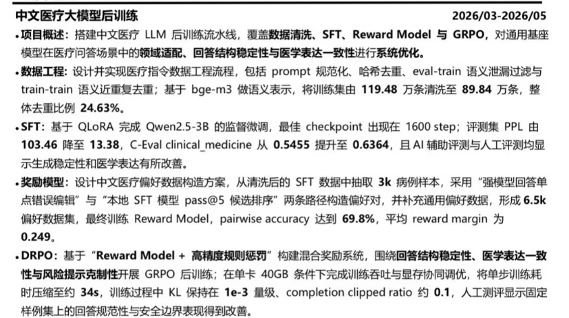

参考图中的流程

# SFT

## 洗数据

用/home/apulis-dev/userdata/2026/MedicalGPT/data_tools/wash中的py进行清洗
- 01用原始csv得到对应格式
- 02过滤掉包含敏感信息的对话
- 03精准去重
- 04minihash去重
- 05用LLM评估数据质量并且过滤掉质量较差的数据
- 06分离train/val/test 并且deleak
- 还加了一部分CMExam的数据，包括利用LLM将CMExam数据从选择题换成QA
最终的数据放在/home/apulis-dev/userdata/2026/MedicalGPT/data/dxw/sft目录下

脚本在/home/apulis-dev/userdata/2026/MedicalGPT/wash.sh

## 训练
在/home/apulis-dev/userdata/2026/MedicalGPT/data/dxw/sft数据上SFT
两张4090

脚本在/home/apulis-dev/userdata/2026/MedicalGPT/scripts/run_sft_accelerate.sh

## 评测
脚本在/home/apulis-dev/userdata/2026/MedicalGPT/eval_ceval.sh和/home/apulis-dev/userdata/2026/MedicalGPT/eval_metrics.sh

+-----------------+---------+---------+---------+--------+--------+--------+--------+---------+--------------+-------------+-------------+--------------+
|      Model      | ROUGE-1 | ROUGE-2 | ROUGE-L | BLEU-1 | BLEU-2 | BLEU-3 | BLEU-4 | Avg Len | Repeat-4gram | BERTScore-P | BERTScore-R | BERTScore-F1 |
+-----------------+---------+---------+---------+--------+--------+--------+--------+---------+--------------+-------------+-------------+--------------+
|       base      |  0.1811 |  0.0210 |  0.0990 | 0.1226 | 0.0433 | 0.0162 | 0.0063 |  454.1  |    0.0173    |    0.6052   |    0.6766   |    0.6386    |
|  checkpoint-500 |  0.2620 |  0.0674 |  0.2081 | 0.2540 | 0.1201 | 0.0672 | 0.0439 |  144.6  |    0.0070    |    0.6808   |    0.6688   |    0.6742    |
| checkpoint-1000 |  0.2682 |  0.0747 |  0.2146 | 0.2706 | 0.1342 | 0.0794 | 0.0545 |  148.9  |    0.0041    |    0.6817   |    0.6744   |    0.6775    |
| checkpoint-2000 |  0.2743 |  0.0792 |  0.2183 | 0.2788 | 0.1406 | 0.0842 | 0.0582 |  154.7  |    0.0065    |    0.6837   |    0.6779   |    0.6803    |
| checkpoint-3000 |  0.2722 |  0.0771 |  0.2175 | 0.2700 | 0.1356 | 0.0822 | 0.0583 |  150.1  |    0.0084    |    0.6828   |    0.6759   |    0.6788    |
| checkpoint-4000 |  0.2758 |  0.0784 |  0.2206 | 0.2695 | 0.1358 | 0.0815 | 0.0568 |  145.7  |    0.0072    |    0.6857   |    0.6771   |    0.6808    |
+-----------------+---------+---------+---------+--------+--------+--------+--------+---------+--------------+-------------+-------------+--------------+

========================================================================================================================
                                       📊 批量计算 4 个医学 C-Eval 任务平均分                              
========================================================================================================================
                                                  
🔹 0shot 结果（共 6 个模型）                                                  
------------------------------------------------------------------------------------------------------------------------
+---------------------+--------------+---------+------------+-------------+--------------+
| 模型名称            |  医学平均分  |  Basic  |  Clinical  |  Physician  |  Veterinary  |
+=====================+==============+=========+============+=============+==============+
| Qwen2.5-3B-sft-1000 |    0.7006    |  0.789  |   0.682    |    0.592    |    0.739     |
+---------------------+--------------+---------+------------+-------------+--------------+
| Qwen2.5-3B-sft-2000 |    0.7006    |  0.789  |   0.682    |    0.592    |    0.739     |
+---------------------+--------------+---------+------------+-------------+--------------+
| Qwen2.5-3B-sft-500  |    0.6892    |  0.789  |   0.636    |    0.592    |    0.739     |
+---------------------+--------------+---------+------------+-------------+--------------+
| Qwen2.5-3B          |    0.6847    |  0.842  |   0.545    |    0.612    |    0.739     |
+---------------------+--------------+---------+------------+-------------+--------------+
| Qwen2.5-3B-sft-3000 |    0.6783    |  0.789  |   0.636    |    0.592    |    0.696     |
+---------------------+--------------+---------+------------+-------------+--------------+
| Qwen2.5-3B-sft-4000 |    0.667     |  0.789  |   0.591    |    0.592    |    0.696     |
+---------------------+--------------+---------+------------+-------------+--------------+

这里的SFT是Qwen2.5-3B-sft-2000
+-------+---------+
| Model |   PPL   |
+-------+---------+
|  Base | 19.2195 |
|  SFT  |  7.0354 |
+-------+---------+

# 偏好数据集构建
- SFT模型生成多个答案,按照与ref的ROUGE,BLEU等指标进行排序,选取top1作为chsosen,最低分或者top2作为rejected,构建偏好数据集
- 调用Qwen3-4B对于ref进行错误的单点修改，生成一个新的答案作为rejected,构建偏好数据集

合并这两种方式得到的偏好数据集,放在data/dxw/reward目录下
代码在data/dxw/step08_preference_grpo

# DPO训练
- 在SFT的基础上进行DPO训练
做了原始的DPO,还做了基于DPOP loss的DPO训练,以及不同loss权重和学习率的DPO训练

## DPO结果
用的偏好数据中的chosen只有一半是原始的ref,另一半是SFT模型生成的答案
估计是lr太大了,导致模型过拟合了这些数据,生成的答案反而和ref差距更大了
+--------------------------------------------------------------------------+---------+---------+---------+--------+--------+--------+--------+---------+--------------+-------------+-------------+--------------+
|                                  Model                                   | ROUGE-1 | ROUGE-2 | ROUGE-L | BLEU-1 | BLEU-2 | BLEU-3 | BLEU-4 | Avg Len | Repeat-4gram | BERTScore-P | BERTScore-R | BERTScore-F1 |
+--------------------------------------------------------------------------+---------+---------+---------+--------+--------+--------+--------+---------+--------------+-------------+-------------+--------------+
|                               dpo-qwen2.5                                |  0.2401 |  0.0502 |  0.1828 | 0.2450 | 0.1007 | 0.0446 | 0.0224 |  199.8  |    0.0605    |    0.6620   |    0.6550   |    0.6578    |
|                         dpo-qwen2.5-dpo_beta1.0                          |  0.2343 |  0.0539 |  0.1831 | 0.2259 | 0.0975 | 0.0485 | 0.0277 |  207.7  |    0.0561    |    0.6669   |    0.6556   |    0.6603    |
|          dpo-qwen2.5-dpo_beta1.0_losssigmoid_sft_weights1.0_0.1          |  0.2303 |  0.0499 |  0.1768 | 0.2064 | 0.0880 | 0.0427 | 0.0238 |  147.9  |    0.0349    |    0.6723   |    0.6372   |    0.6532    |
|      dpo-qwen2.5-dpo_beta1.0_losssigmoid_sft_weights1.0_0.4_lr1e-4       |  0.2338 |  0.0539 |  0.1787 | 0.1840 | 0.0836 | 0.0439 | 0.0263 |  129.8  |    0.0303    |    0.6839   |    0.6369   |    0.6586    |
| dpo-qwen2.5-dpo_beta1.0_losssigmoid_dpop_weights1.0_0.4_lr1e-4_warmup100 |  0.2352 |  0.0548 |  0.1775 | 0.1650 | 0.0766 | 0.0406 | 0.0245 |  116.1  |    0.0302    |    0.6867   |    0.6331   |    0.6578    |
| dpo-qwen2.5-dpo_beta1.0_losssigmoid_dpop_weights1.0_5.0_lr1e-4_warmup100 |  0.2292 |  0.0513 |  0.1724 | 0.1417 | 0.0653 | 0.0345 | 0.0211 |  105.6  |    0.0235    |    0.6858   |    0.6272   |    0.6543    |
+--------------------------------------------------------------------------+---------+---------+---------+--------+--------+--------+--------+---------+--------------+-------------+-------------+--------------+

new_dpo是把数据的chosen全部换成ref,重新训练DPO
onOriginalMedicalData则是在medicalGPT原始的medical数据上进行DPO训练
+----------------------------------------------------------------------------------------+---------+---------+---------+--------+--------+--------+--------+---------+--------------+-------------+-------------
|                                         Model                            | ROUGE-1 | ROUGE-2 | ROUGE-L | BLEU-1 | BLEU-2 | BLEU-3 | BLEU-4 | Avg Len | Repeat-4gram | BERTScore-P | BERTScore-R | BERTScore-F1 |
+----------------------------------------------------------------------------------------+---------+---------+---------+--------+--------+--------+--------+---------+--------------+-------------+-------------
|                qwen2.5-new_dpo_beta0.1_sigmoid_1.0_lr5e-4                |  0.2021 |  0.0356 |  0.1484 | 0.1480 | 0.0549 | 0.0229 | 0.0104 |  324.9  |    0.1453    |    0.6320   |    0.6404   |    0.6354    |
|            qwen2.5-new_dpo_beta0.1_sigmoid_sft_1.0_0.2_lr5e-4            |  0.2281 |  0.0458 |  0.1704 | 0.2206 | 0.0897 | 0.0416 | 0.0212 |  197.3  |    0.0570    |    0.6622   |    0.6474   |    0.6538    |
|     qwen2.5-onOriginalMedicalData_new_dpo_beta0.1_sigmoid_1.0_lr5e-4     |  0.1892 |  0.0291 |  0.1250 | 0.1334 | 0.0493 | 0.0210 | 0.0099 |  247.1  |    0.1277    |    0.6467   |    0.6248   |    0.6342    |
| qwen2.5-onOriginalMedicalData_new_dpo_beta0.1_sigmoid_sft_1.0_0.2_lr5e-4 |  0.1923 |  0.0296 |  0.1252 | 0.1223 | 0.0496 | 0.0230 | 0.0117 |  123.2  |    0.0294    |    0.6659   |    0.6179   |    0.6399    |
+----------------------------------------------------------------------------------------+---------+---------+---------+--------+--------+--------+--------+---------+--------------+-------------+-------------

+------------------------------------------------------------------------------------+---------+---------+---------+--------+--------+--------+--------+---------+--------------+-------------+-------------+--------------+
|                                       Model                                        | ROUGE-1 | ROUGE-2 | ROUGE-L | BLEU-1 | BLEU-2 | BLEU-3 | BLEU-4 | Avg Len | Repeat-4gram | BERTScore-P | BERTScore-R | BERTScore-F1 |
+------------------------------------------------------------------------------------+---------+---------+---------+--------+--------+--------+--------+---------+--------------+-------------+-------------+--------------+
|                                        base                                        |  0.2734 |  0.0792 |  0.2179 | 0.2809 | 0.1420 | 0.0859 | 0.0601 |  158.3  |    0.0098    |    0.6840   |    0.6782   |    0.6805    |
|     Qwen2.5-3B-dpo-qwen2.5-c_all_ref---r_0.5_path2chosen_1.0_sigmoid_1.0_2e-5      |  0.2731 |  0.0755 |  0.2171 | 0.3013 | 0.1461 | 0.0836 | 0.0554 |  177.0  |    0.0145    |    0.6811   |    0.6828   |    0.6815    |
|     Qwen2.5-3B-dpo-qwen2.5-c_all_ref---r_0.5_path2chosen_1.0_sigmoid_1.0_5e-6      |  0.2735 |  0.0772 |  0.2159 | 0.3005 | 0.1481 | 0.0873 | 0.0596 |  188.7  |    0.0218    |    0.6797   |    0.6837   |    0.6812    |
| Qwen2.5-3B-dpo-qwen2.5-c_all_ref---r_0.5_path2chosen_1.0_sigmoid_dpop_1.0_0.2_2e-5 |  0.2723 |  0.0753 |  0.2151 | 0.2869 | 0.1407 | 0.0814 | 0.0544 |  162.2  |    0.0116    |    0.6831   |    0.6793   |    0.6807    |
| Qwen2.5-3B-dpo-qwen2.5-c_all_ref---r_0.5_path2chosen_1.0_sigmoid_dpop_1.0_0.2_5e-6 |  0.2734 |  0.0777 |  0.2163 | 0.2984 | 0.1475 | 0.0865 | 0.0586 |  177.1  |    0.0172    |    0.6823   |    0.6820   |    0.6816    |
| Qwen2.5-3B-dpo-qwen2.5-c_all_ref---r_0.5_path2chosen_1.0_sigmoid_dpop_1.0_5.0_2e-5 |  0.2775 |  0.0787 |  0.2187 | 0.2838 | 0.1417 | 0.0846 | 0.0583 |  156.9  |    0.0091    |    0.6856   |    0.6798   |    0.6822    |
| Qwen2.5-3B-dpo-qwen2.5-c_all_ref---r_0.5_path2chosen_1.0_sigmoid_dpop_1.0_5.0_5e-6 |  0.2742 |  0.0790 |  0.2176 | 0.2852 | 0.1437 | 0.0860 | 0.0592 |  161.9  |    0.0111    |    0.6843   |    0.6794   |    0.6813    |
| Qwen2.5-3B-dpo-qwen2.5-c_all_ref---r_0.5_path2chosen_1.0_sigmoid_sft_1.0_0.2_2e-5  |  0.2715 |  0.0758 |  0.2169 | 0.2971 | 0.1450 | 0.0837 | 0.0561 |  171.8  |    0.0119    |    0.6809   |    0.6820   |    0.6809    |
| Qwen2.5-3B-dpo-qwen2.5-c_all_ref---r_0.5_path2chosen_1.0_sigmoid_sft_1.0_0.2_5e-6  |  0.2713 |  0.0782 |  0.2155 | 0.2965 | 0.1470 | 0.0868 | 0.0593 |  192.9  |    0.0227    |    0.6789   |    0.6837   |    0.6808    |
| Qwen2.5-3B-dpo-qwen2.5-c_all_ref---r_0.5_path2chosen_1.0_sigmoid_sft_1.0_5.0_2e-5  |  0.2741 |  0.0764 |  0.2174 | 0.2852 | 0.1407 | 0.0822 | 0.0556 |  160.5  |    0.0106    |    0.6849   |    0.6797   |    0.6818    |
| Qwen2.5-3B-dpo-qwen2.5-c_all_ref---r_0.5_path2chosen_1.0_sigmoid_sft_1.0_5.0_5e-6  |  0.2714 |  0.0774 |  0.2149 | 0.3001 | 0.1487 | 0.0879 | 0.0601 |  182.7  |    0.0166    |    0.6800   |    0.6818   |    0.6804    |
+------------------------------------------------------------------------------------+---------+---------+---------+--------+--------+--------+--------+---------+--------------+-------------+-------------+--------------+

+----------------------------------------------------------------------------------------+---------+---------+---------+--------+--------+--------+--------+---------+--------------+-------------+-------------+--------------+
|                                         Model                                          | ROUGE-1 | ROUGE-2 | ROUGE-L | BLEU-1 | BLEU-2 | BLEU-3 | BLEU-4 | Avg Len | Repeat-4gram | BERTScore-P | BERTScore-R | BERTScore-F1 |
+----------------------------------------------------------------------------------------+---------+---------+---------+--------+--------+--------+--------+---------+--------------+-------------+-------------+--------------+
|                                          base                                          |  0.2746 |  0.0811 |  0.2197 | 0.2793 | 0.1428 | 0.0875 | 0.0619 |  155.8  |    0.0089    |    0.6847   |    0.6784   |    0.6810    |
|     Qwen2.5-3B-dpo-qwen2.5-c_all_ref---r_all_path2afterpath1_1.0_sigmoid_1.0_2e-5      |  0.2741 |  0.0764 |  0.2185 | 0.2936 | 0.1445 | 0.0845 | 0.0571 |  166.5  |    0.0090    |    0.6828   |    0.6822   |    0.6820    |
|     Qwen2.5-3B-dpo-qwen2.5-c_all_ref---r_all_path2afterpath1_1.0_sigmoid_1.0_5e-6      |  0.2745 |  0.0797 |  0.2192 | 0.3038 | 0.1512 | 0.0894 | 0.0611 |  176.2  |    0.0092    |    0.6800   |    0.6846   |    0.6819    |
| Qwen2.5-3B-dpo-qwen2.5-c_all_ref---r_all_path2afterpath1_1.0_sigmoid_dpop_1.0_0.2_2e-5 |  0.2762 |  0.0787 |  0.2193 | 0.2841 | 0.1415 | 0.0833 | 0.0567 |  156.9  |    0.0100    |    0.6844   |    0.6799   |    0.6816    |
| Qwen2.5-3B-dpo-qwen2.5-c_all_ref---r_all_path2afterpath1_1.0_sigmoid_dpop_1.0_5.0_2e-5 |  0.2731 |  0.0765 |  0.2169 | 0.2784 | 0.1381 | 0.0815 | 0.0557 |  153.7  |    0.0084    |    0.6845   |    0.6781   |    0.6808    |
| Qwen2.5-3B-dpo-qwen2.5-c_all_ref---r_all_path2afterpath1_1.0_sigmoid_sft_1.0_0.2_2e-5  |  0.2718 |  0.0758 |  0.2155 | 0.2965 | 0.1453 | 0.0855 | 0.0585 |  177.8  |    0.0156    |    0.6791   |    0.6819   |    0.6800    |
| Qwen2.5-3B-dpo-qwen2.5-c_all_ref---r_all_path2afterpath1_1.0_sigmoid_sft_1.0_5.0_2e-5  |  0.2761 |  0.0777 |  0.2198 | 0.2879 | 0.1430 | 0.0836 | 0.0565 |  159.5  |    0.0101    |    0.6855   |    0.6810   |    0.6828    |
+----------------------------------------------------------------------------------------+---------+---------+---------+--------+--------+--------+--------+---------+--------------+-------------+-------------+--------------+

# reward model

# GRPO
